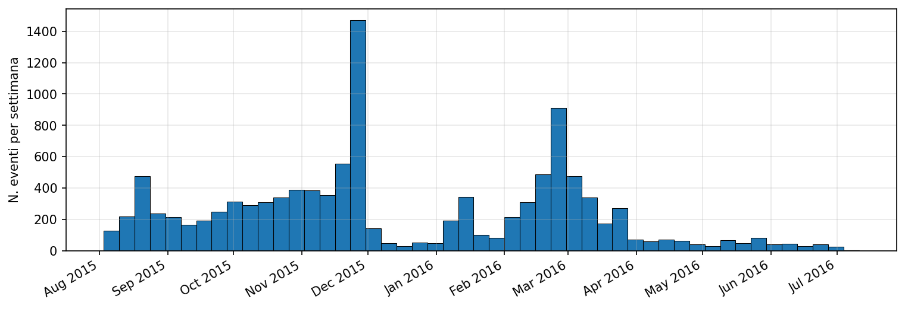
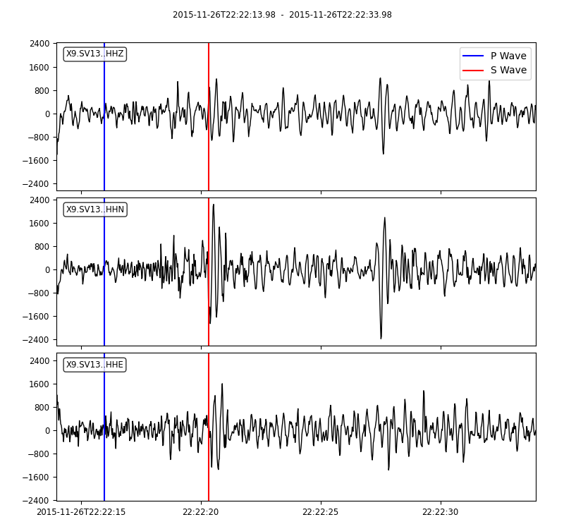

# Thesis

Thesis work on the classification of pre and post eruption seismic events relative to the Klyuchevskoy volcano eruption of April $21^{st}$ 2016.

This project uses the catalog from the [KISS experiment](https://geofon.gfz.de/doi/network/X9/2015) in Kamchatka recorded by the X9 network from July 2015 to August 2016. 
The dataset consists of 11,209 events recorded across 77 different stations at a sampling rate of 50 Hz.

## KISS Dataset Description

The study area is located around Klyuchevskoy Volcano, where the 77 stations are distributed as shown in the following Figure 

In order to compute a proper classification we have to distinguish events occured Before and After the Eruption of interess, so we plot the distribution of events over time and mark with a line the date April $21^{st}$

Then for each station we can see which event recorded.

As we can see, not all stations recorded events that occurred after the volcanic eruption: only 41 of all the 77 stations in the X9 network actually have such data.

In the following figure, we highlight in blue the stations which recorded post Eruption events and in red those that did not.

These are the stations from which we will take the data.

## Models

For the classification task, we compare two models, **CNN1D** and **CNN2D**, trained on the same dataset. 
The first model is trained on the raw waveforms, while the second is trained on their corresponding spectrograms.

## Dataset

The dataset we use is highly imbalanced: it contains roughly **90,000 Pre-Eruption** samples and **4,600 Post-Eruption** samples. A sample refers to a specific event recorded by a specific station.ù
in total, we have **41 stations** (all stations that recorded post-eruption as shown in the **Event Distribution** section), which recorded a combined **8,610 distinct Pre-Eruption events** and **480 Post-Eruption events**.

To train the models, we take all Post-Eruption samples together with a random subset of Pre-Eruption samples, forming a balanced dataset. This dataset then is split into training, validation, and test sets following an 80/10/10 ratio.

It is important to note that the splits are built by the event to avoid data leakage: all recordings of a given event are assigned to only one of the three sets (train, validation, or test).

### Waveforms

The CNN1D model is trained on the raw waveforms. Each sample consists of a 20 second recording sampled at 50 Hz.
The recording window for each event starts 2 seconds before the P-wave arrival and ends 18 seconds after it. 

The figure below shows an example waveform with the P and S wave arrivals marked.

## Spectrogram

_WIP_

### Hyper Parameters

We are using for both models the same characteristics, a training over 100 Epochs with a Binary Cross Entropy Loss.
The Optimizer we are using is Adam and we also implemented a Scheduler to stabilize the model's performance in the ending of the training.

### CNN1D

Graphs for the Loss and Accuracy Values over training

Confusion Matrices for Train Validation and Test sets

### CNN2D

Graphs for the Loss and Accuracy Values over training

Confusion Matrices for Train Validation and Test sets

The training over 100 epochs ends with a 70% accuracy on the test set.

