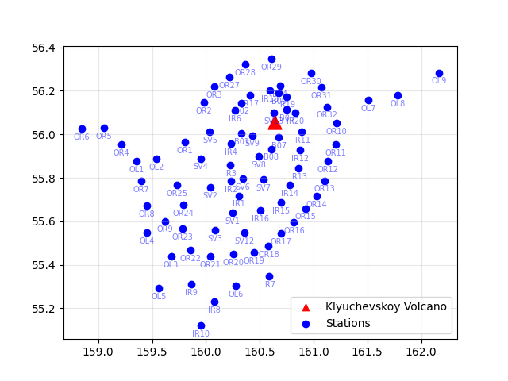
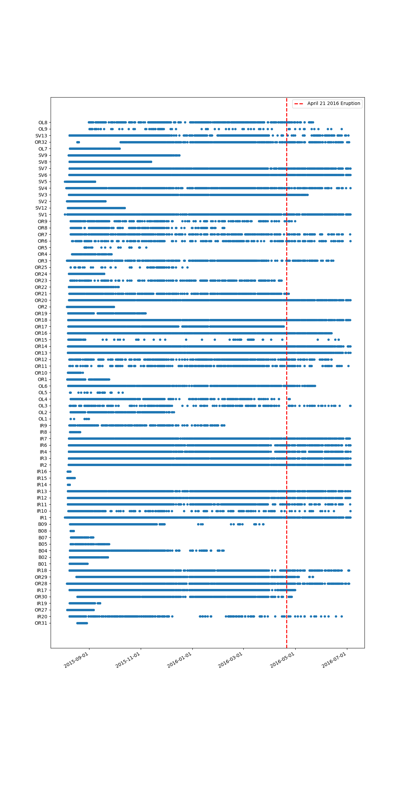
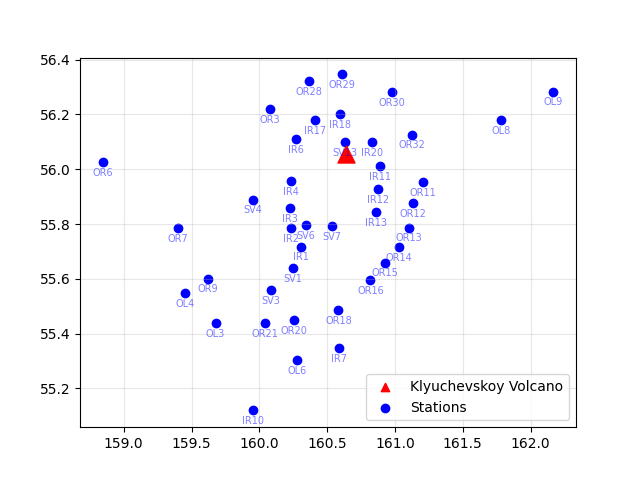

# Thesis

Thesis work on the classification of pre- and post-eruption seismic events.

This project uses the catalog from the KISS experiment in Kamchatka, covering the period from July 2015 to August 2016 (https://geofon.gfz.de/doi/network/X9/2015). The dataset consists of 11,209 events recorded across 77 different stations.

## Event Distribution

The study area is located around Klyuchevskoy Volcano, where the 77 stations are distributed as shown in the following Figure 

The following plot shows the distribution of events over the full time span:

And for each station we show in the next figure which Events it recorded:

## Waveforms

Each event is recorded by a number of stations. For each station, the catalog provides a waveform along with the arrival times of the P and S waves:

## Classification

In order to compute a proper classification we have to distinguish events occured Before and After the Eruption, as we saw in the Events Distribution Figure we notice there
aren't as many Post-Eruption events as the Pre-Eruption ones.

In the next Figure we show which stations recorded Post- Eruption Events

## Event Grouping

The spatial distribution of all recorded events is shown in the 3D plot below:

Based on their spatial proximity, the events can be organized into four distinct groups:

## Classification

The main eruption of Klyuchevskoy volcano occurred on the $21^{st}$ of April of 2016, since then 480 events occurred in the experiment's Area and were registred by 33 differents stazions

